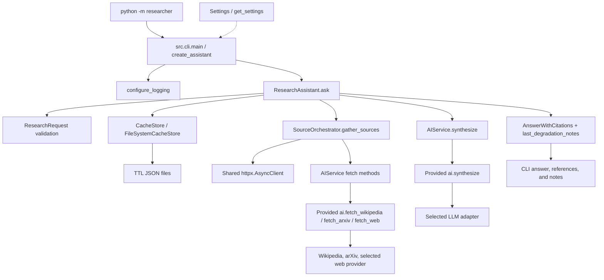

# Architecture — Async Research Assistant

The team's SE layer composes the provided AI module into an asynchronous CLI
application. Setup, environment variables, and measured verification results are
in the [README](../README.md).

## Components and dependencies

The arrows describe calls and dependencies; source HTTP requests receive the
client created by the orchestrator. The CLI factory supplies the same validated
settings to the service, orchestrator, and assistant, and passes cache settings
to the store.

| Layer | Responsibility |
| --- | --- |
| Entry point and CLI | Parse arguments, construct components, run the coroutine, sanitize terminal output, and translate supported domain errors. |
| Configuration and logging | Typed settings, cached configuration lookup, and idempotent root-logger setup. |
| Models and exceptions | Canonical source enum, question/source validation, cache keys, degradation records, and domain error types. |
| ResearchAssistant | Coordinate the request, cache reads/writes, missing-source retrieval, and synthesis. |
| CacheStore | Abstract `get`, `set`, and `delete` contract; `FileSystemCacheStore` supplies persistence. |
| SourceOrchestrator | Concurrent source tasks, semaphore, shared client, request-level source deadlines, and partial-failure collection. |
| AIService | SE boundary to `ai.*`; retry policy, timed attempts, diagnostics, and threaded synchronous synthesis. |
| Provided `ai/` | Fetch implementations, provider adapters, synthesis prompt, and `Source` / `Citation` / `AnswerWithCitations` schemas. |

## Request flow

1. `researcher.__main__` delegates to `src.cli.main()`. Argparse requires an `ask`
   question and parses optional comma-separated `wiki,arxiv,web` names and
   `--no-cache`. The factory loads settings, configures logging, and composes the
   real components. `asyncio.run()` executes `ResearchAssistant.ask()`.
2. `ResearchRequest.create()` strips the question, rejects empty or over-2,000
   character input, and validates/deduplicates the source list. Validation errors
   become `InvalidQuestionError`. The default selection is all three sources.
3. The assistant canonicalizes the query and reads each requested source from the
   cache. Available entries are accumulated; only missing entries are fetched.
   `use_cache=False` skips both cache reads and subsequent writes.
4. `gather_sources()` opens one `httpx.AsyncClient`, creates a coroutine per missing
   source, and awaits `asyncio.gather(..., return_exceptions=True)`. Each task
   acquires the semaphore, starts a per-source timeout, and calls the appropriate
   `AIService` method with the shared client.
5. The service invokes the provided `ai.*` function through its timed retry wrapper.
   The orchestrator converts task failures into `DegradationNote` records, including
   a distinct timeout reason, while retaining successful results. A successful
   empty list is not itself a failure note.
6. The assistant writes successful fetched results to their per-source cache
   entries, including successful empty lists. Failed sources are not cached. It
   exposes notes through `last_degradation_notes`. If the combined cached/fetched
   results are empty, it raises `AllSourcesFailedError`.
7. `AIService.synthesize()` runs the provided synchronous `ai.synthesize()` in
   `asyncio.to_thread()`. The original stripped question and collected sources are
   passed to synthesis. The LLM produces text; the provided synthesizer extracts
   in-range numeric references into `Citation(index, source)` objects. Final
   answers are not cached.
8. The CLI prints the answer, references in numeric index order, and degradation
   notes. Reference entries contain origin, title, and URL. Intentional errors use
   stderr; runtime diagnostics use logging. Invalid requests exit 2, no available
   sources exits 1, and successful output exits 0.

## Concurrency and timeout design

Asyncio suits independent I/O waits: while one source awaits network activity,
another can make progress. A semaphore bounds simultaneous source tasks using
`MAX_SOURCES_PER_QUERY` (default 3). The same setting is also the default per-source
result limit used by `AIService`.

The HTTP client is shared for the source-fetch batch and closed by its async
context manager. The provided Wikipedia/arXiv fetchers and HTTP-based web adapters
accept that client. The DuckDuckGo adapter instead runs its own synchronous search
library in a thread and does not use the supplied client.

The orchestrator's `PER_SOURCE_TIMEOUT_SECONDS` deadline starts after semaphore
acquisition and covers the facade call, including retry waits. The service also
applies a timeout to each fetch attempt. Therefore retries can be cut short by
the outer source deadline. Synthesis has a separate default 60-second timeout per
attempt. There is no single overall research-request deadline.

## Caching design

`FileSystemCacheStore` writes a JSON file for each `(SourceName, canonical query)`
key. Canonicalization lowercases, collapses whitespace, and removes trailing
`?`, `.`, and `!`; for example, differently cased forms of the same question reuse
source entries. A SHA-256 digest of the source/query pair forms the filename.

Each entry contains its storage time, canonical source/query, and serialized
`Source` values. Reads apply the configured TTL (default 86,400 seconds); expired,
unreadable, or invalid entries become misses, with best-effort cleanup. Writes use
a temporary file and `os.replace()` so readers do not see a partially written
entry. Write failures raise `CacheError`. Persistence allows a new assistant
instance or a later local process to reuse results. `--no-cache` bypasses reads
and writes, while synthesis still runs on every request.

## Robustness and diagnostics

- `AIService` uses Tenacity for at most three attempts by default. Exponential
  backoff starts at 0.5 seconds and is capped at 8 seconds. Retries apply to
  `ProviderError`, timeouts, HTTP transport errors, HTTP 429, and HTTP 5xx errors.
  Other errors propagate. The retry unit is the wrapped fetch/synthesis operation,
  not an independently instrumented retry loop for each internal HTTP request.
- Pydantic owns typed settings, request validation, and cache/schema validation.
  `SourceName.WIKI` maps to the provided schema's `wikipedia` origin.
- Per-source failure isolation preserves usable results and reports unavailable
  sources. It does not mask a failed final synthesis or a cache write error.
- Logging records operation starts, attempts, durations, outcomes, and retries.
  INFO includes questions and source summaries; DEBUG includes fuller payloads.
  The service redacts common credential assignments and removes source URL
  credentials, query strings, and fragments in its log payloads.
- Terminal sanitation removes ANSI/control sequences from intentional CLI output
  while keeping normal Unicode and citation markers. This is terminal hygiene,
  not a claim-verification or general HTML-security system.

## Composition and entry points

`ResearchAssistant` receives an `AIService`, a `CacheStore`, a
`SourceOrchestrator`, and `Settings` through its constructor. It delegates storage,
fetching, and synthesis to those objects instead of inheriting their behavior.
This is a concrete example of composition in the team's code; the abstract cache
contract also permits substituting storage in tests. `SourceOrchestrator`
similarly composes the service and settings. The provided provider-class
inheritance belongs to the supplied AI package, not the team's implementation.

The thin `researcher/` package exists because the required command is
`python -m researcher`, while the implementation lives in `src/`. Its entry point
imports and calls `src.cli.main()`; it contains no business logic. `src/__main__.py`
delegates to the same function, preserving the existing package/import layout.

## Offline verification paths

The seven integration/demo tests retain real settings, filesystem storage, facade,
orchestrator, assistant, and citation synthesis. External fetch functions and LLM
selection are replaced, and a socket/DNS guard checks that the tests remain
offline. Cache tests use temporary directories.

`scripts/demo.py` reuses the supplied `_OfflineSources` and `_OfflineLLM` fixtures
inside scoped patches, with a temporary real cache. It runs all five dataset
questions and refreshes only its named JSON outputs. JSON serialization uses
Pydantic and includes explicit offline provenance and degradation records.

`scripts/benchmark.py` has a different purpose: it substitutes delayed fake source
methods and measures sequential fetching against the real orchestrator. It does
not measure live HTTP, LLM work, cache performance, or retry overhead. Exact
measurements and the unresolved mypy diagnostics are recorded in the README.
